# Creating a Microsoft Flow to email yourself when an Office 365 IP/URL change occurs

This article is an updated method for demonstrating how you can use Microsoft Flow to alert yourself with an email whenever there are changes to the Office 365 IP Addresses or URLs. This improves on the previous Flow by removing the requirement for a SharePoint Online list to be created for state management and by including English formatted text in the email body describing the changes instead of the previous JSON file attachments.

I&#39;ve divided this article into two parts since the first part is much simpler than the second. The first part is to create the flow and get an email notification and the second part is to format the change list in English text instead of JSON.

The Flow created in this article is not supported by Microsoft and you should follow your own development review processes before relying on it in a production environment.

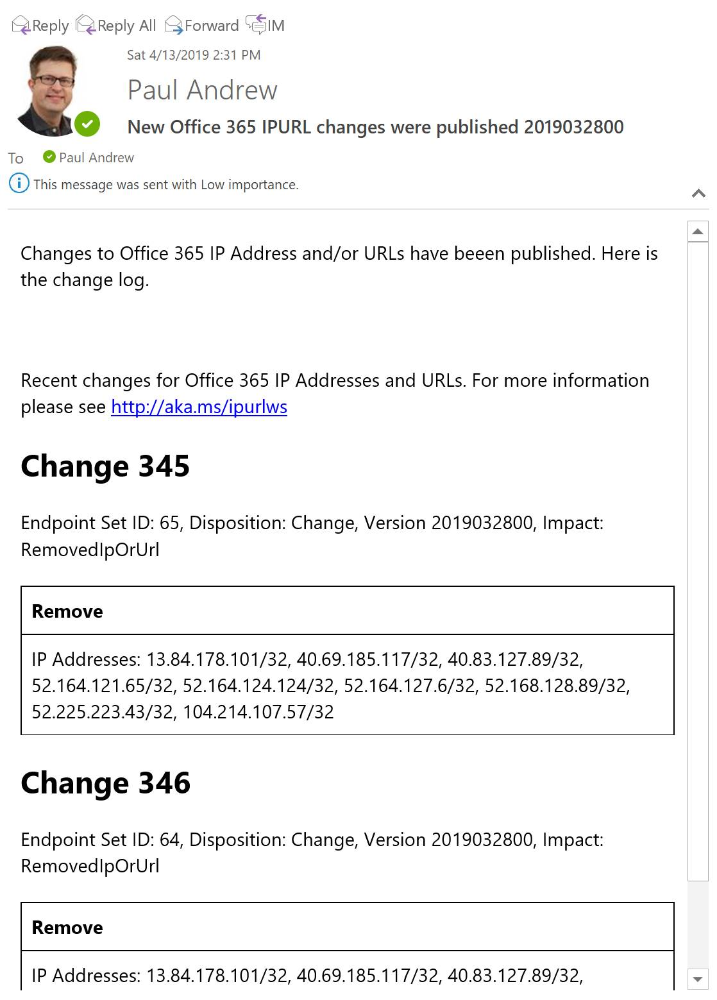

_Figure 1 – Completed change notification email result_

## Step 1 – Sign up for Microsoft Flow

Flow requires sign-up. I&#39;ve only used free elements in Flow for this. You can read about the sign-up process and the free and paid plans at [https://docs.microsoft.com/en-us/flow/sign-up-sign-in](https://docs.microsoft.com/en-us/flow/sign-up-sign-in)

Once you&#39;ve signed up you can go to flow at [https://flow.microsoft.com](https://flow.microsoft.com/)

## Step 2 – Create a flow

At the flow home page, select My Flows from the left side navigation menu. On the My Flows page you can select + New at the top of the page and select Create from blank to create your flow.

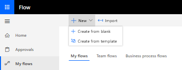

_Figure 2 - Create from blank command_

## Step 3 – Add the trigger

A trigger starts your flow executing. We&#39;re going to check the version of the Office 365 network endpoints using the RSS feed.

The RSS feed trigger is not very easy to test so you will want to use the Recurrence trigger for testing so that you get a trigger for the flow once a minute.

Let&#39;s keep going with the RSS trigger here. You can delete it and add the Recurrence to test and then delete your Recurrence and add an RSS trigger back if testing and debugging is needed.

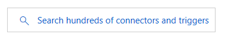

_Figure 3 - Search triggers command_

Click the search as shown in Figure 2 and enter RSS in the search box. It will begin searching immediately and the orange RSS trigger should appear. Select it.

There&#39;s one parameter for the RSS trigger which is the URL to look up. This URL will be custom for the service instance that you want to monitor. You can use this URL to get the RSS feed for the most commonly used service instance. It&#39;s called Office 365 Worldwide Commercial/GCC.

https://endpoints.office.com/version/worldwide?format=rss&AllVersions&clientrequestid=bad1f103-bad1-f103-0123-456789abcdef

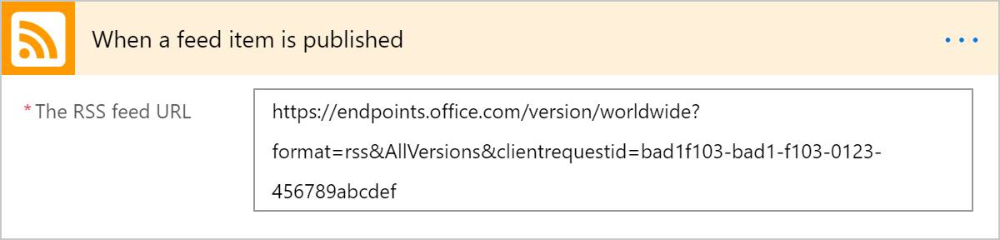

_Figure 4 - Configured RSS trigger_

## Step 4 – Adding the actions

Then click the + New step command and choose Add an action.

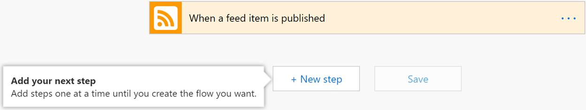

_Figure 5 – New step command_

Search for the HTTP action and select it. It&#39;s the first on the result list on figure 5.

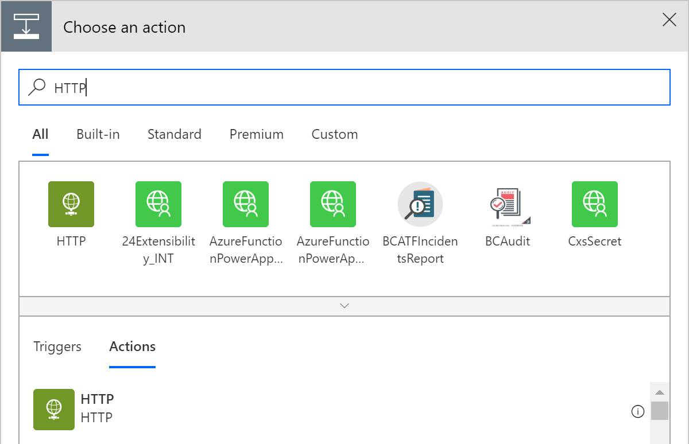

_Figure 6 – New step command_

Configure the HTTP action to GET the version list for the endpoints from the web service.

https://endpoints.office.com/version/worldwide?allversions&amp;clientrequestid=bad1f103-bad1-f103-0123-456789abcdef

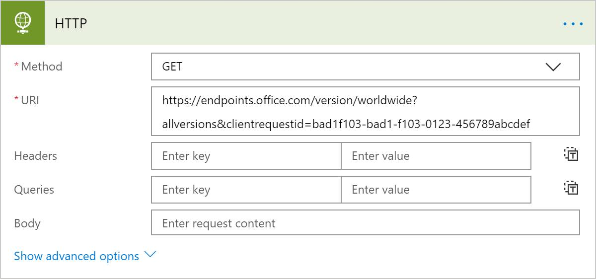

_Figure 7 – Parameters for GET HTTP action_

Click the + New step command below the HTTP action and search for JSON to locate the Parse JSON action.

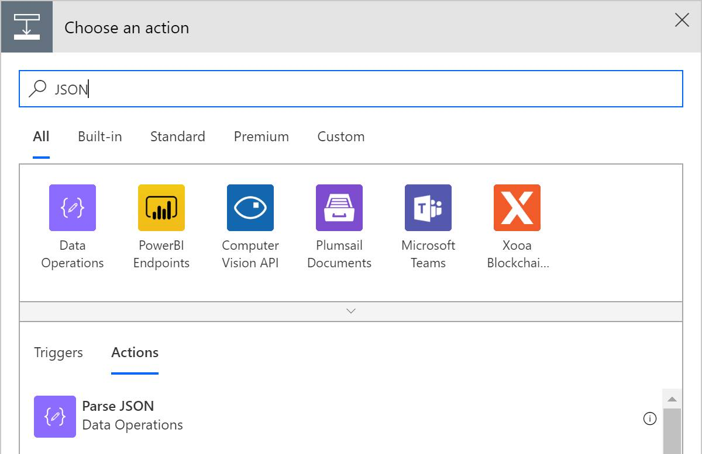

_Figure 8 – Action search results showing the Parse JSON action_

Configure the Parse JSON parameters to read the results from the web service.

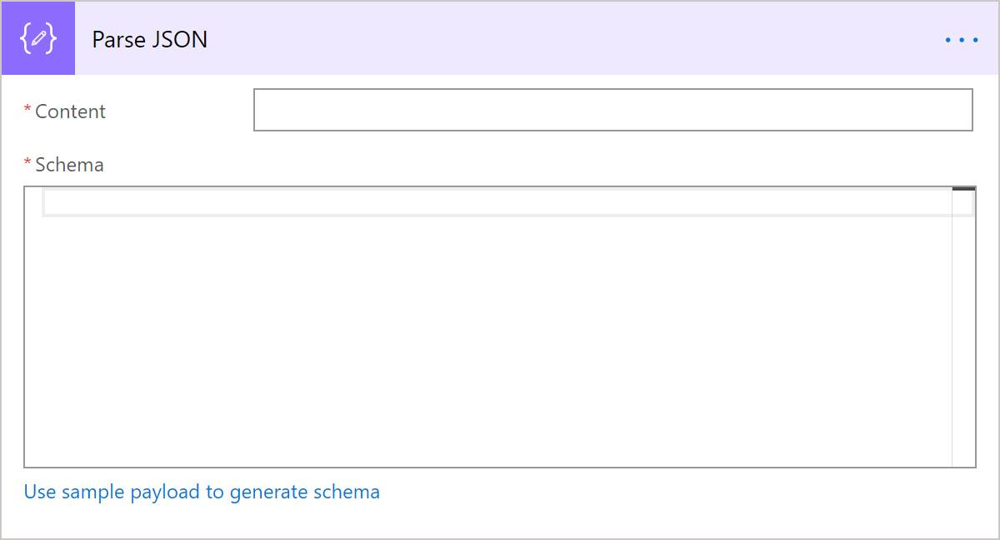

_Figure 9 – Configuring the Parse JSON action_

Click in the Content property window and you will see the dynamic content selector. Choose the Body content item which is the output of the previous action.

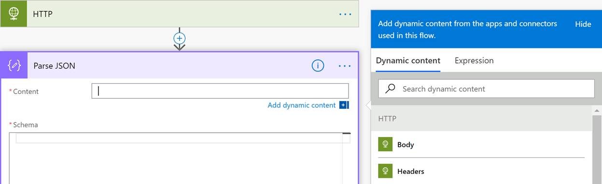

_Figure 10 – Selecting the Body content item_

Next, we are going to setup the schema so that the Parse JSON action can read the web service output. Launch a web browser and paste in the

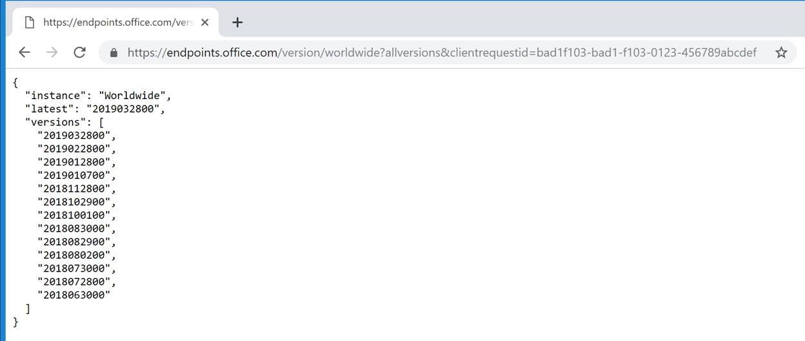

_Figure 11 – Getting a sample output payload for the web service._

Click use sample payload to generate schema.

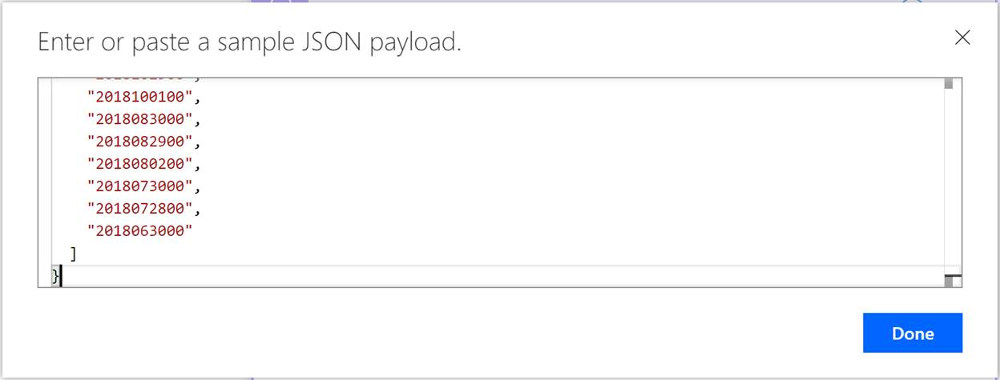

_Figure 12 – Getting a sample output payload for the web service._

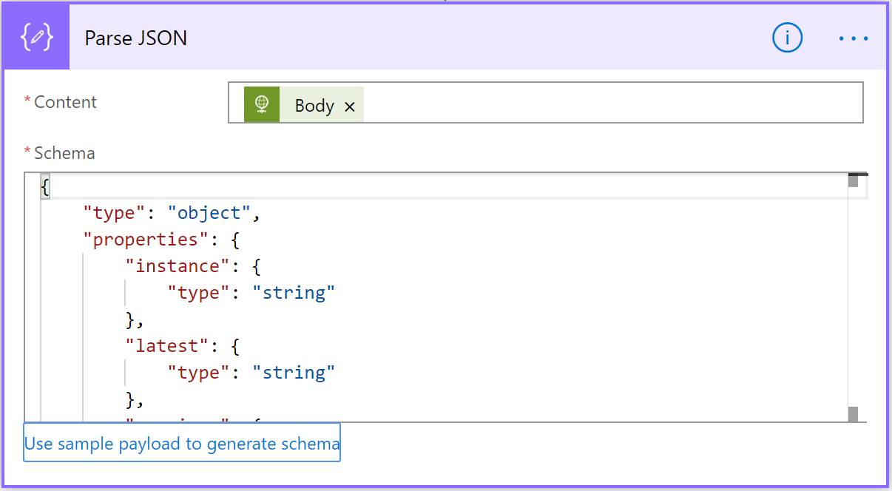

_Figure 13 - Configured Parse JSON action_

Add a second HTTP action and configure it for a GET operation. This second HTTP action is to get the list of changes that were published in the latest update. We will configure this to get the JSON format data and include that in the notification email first. Later we will come back and update this HTTP action to get English formatted text describing the changes. Those are added later because there is more work to create them than just to include the JSON format data.

The URI for this HTTP GET is going to be more complex than in the first HTTP GET action as it includes a dynamic parameter. Enter the first part of the URI as:

https://endpoints.office.com/changes/worldwide/

Then click Expression in the expanded right properties window and enter a reference to the second version item from the Parse JSON action. This selects the version prior to the current version so that you can see the latest changes.

**body(**&#39;Parse\_JSON&#39;**)**?[&#39;versions&#39;][1]

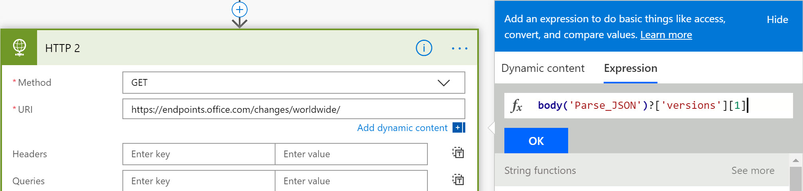

_Figure 14 – First part of URI entered_

Click OK to accept the Expression and then enter the second part of the URI.

?clientrequestid=bad1f103-bad1-f103-0123-456789abcdef

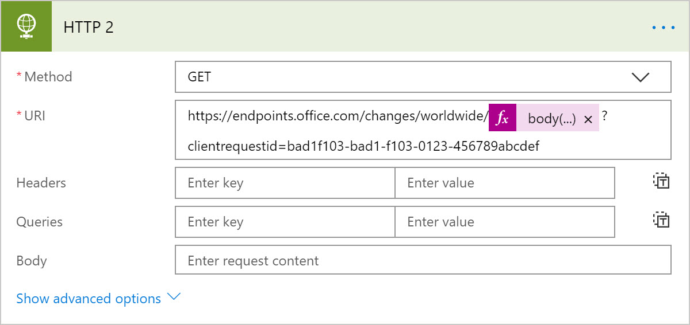

_Figure 15 – Expression and second part of URI entered_

Select + New step and search for the Office 365 Send an email action.

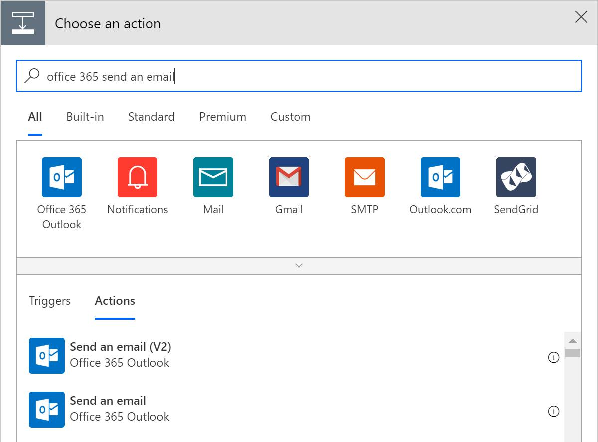

_Figure 16 – Searching for the send an email action_

Select the Send an email (V2) action.

Configure the Send an email action with your own email to address. Enter a subject line in two parts. The first part is static:

New Office 365 IPURL changes were published

The second part of the subject will be the version number that we just found. With the cursor at the end of the subject text, select the Expression tab in the expanded right properties window and enter the expression to reference the latest version in the JSON output from the version web service.

**body(**&#39;Parse\_JSON&#39;**)**?[&#39;latest&#39;]

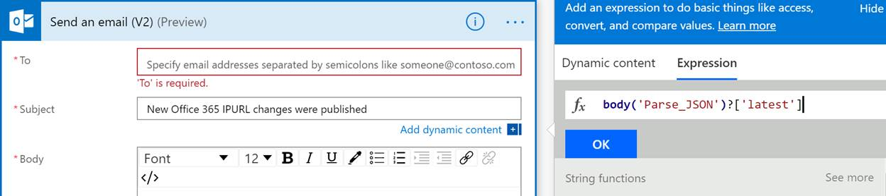

_Figure 17 – Searching for the send an email action_

Next select OK to enter the expression into the Subject and do the same thing for the Body. Enter some static text for the Body.

&quot;Changes to Office 365 IP Address and/or URLs have been published. Here is the change log.&quot;

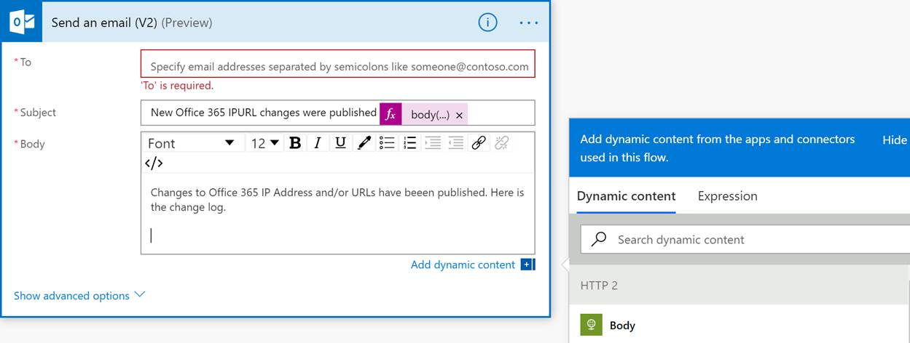

_Figure 18 – The email action with the subject complete and the static text entered in the body_

Select the HTTP 2 action Body for the rest of the email body.

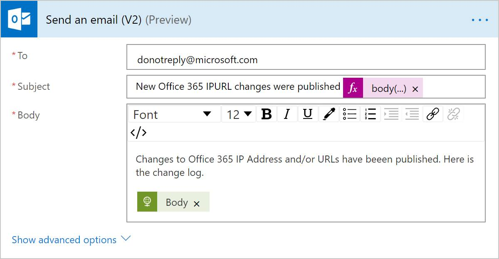

_Figure 19 – The completed email action. Please substitute your own email address_

You are complete and can now save the flow.

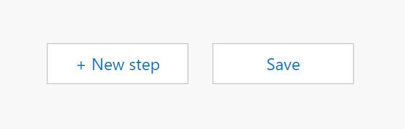

_Figure 20 – The save button at the bottom of the flow_

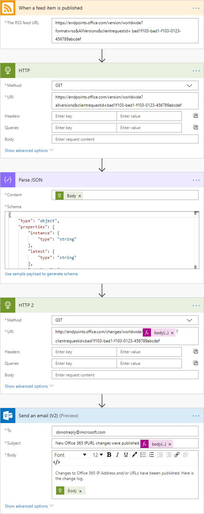

_Figure 21 – The completed flow_

## Step 5 – Testing and troubleshooting the flow

The flow only triggers when a new RSS article is published, and this only occurs one or two times a month so it&#39;s important to be able to have some means to test the flow. To do this we will delete the RSS trigger and replace it with a Recurrence trigger that fires every minute. If the flow is working, you will get an email every minute due to the Recurrence firing and that email will include the most recent changes. When you have this working, delete the Recurrence trigger and put back the RSS trigger.

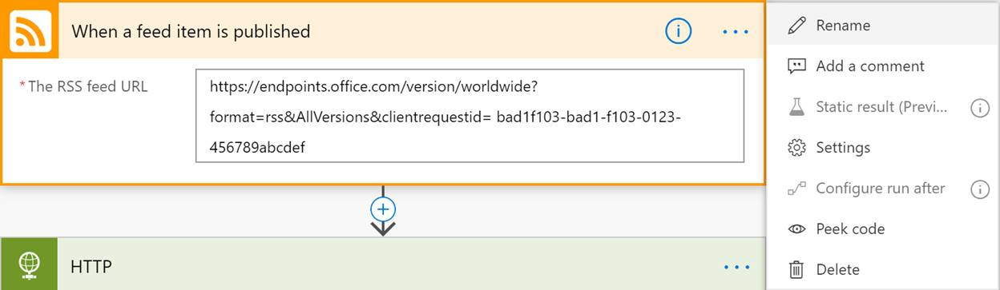

_Figure 22 – The menu to delete the RSS trigger_

Select Delete. Once this is deleted you will be prompted to add a new trigger. Enter Recurrence in the search box and select the Recurrence Schedule activity.

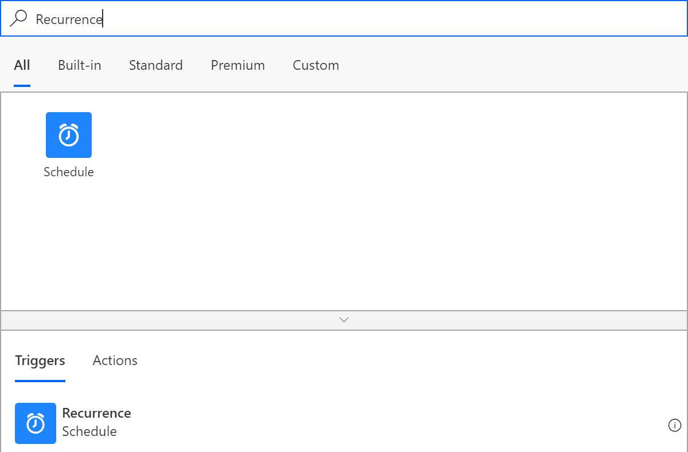

_Figure 23 – Adding the schedule trigger_

The default properties for the schedule trigger are to fire the flow once a minute. Leave these as is and save the flow. You should receive an email within a minute containing the latest changes. Now you can observe the flow executing, look at data accessed by each activity and do any needed troubleshooting in execution logs.

## Step 6 – Creating an Azure Function for formatting

To create emails with English formatted changes we will use an Azure Function written in JavaScript which calls the changes web service and creates the English formatted output.

Before creating an Azure Function it would be helpful to read the Azure Function JavaScript documentation here: [https://docs.microsoft.com/en-us/azure/azure-functions/functions-reference-node](https://docs.microsoft.com/en-us/azure/azure-functions/functions-reference-node)

Go to the Azure Portal at [http://portal.azure.com](http://portal.azure.com)

Sign-in with your Azure subscription account.

Click Create a resource and type &quot;function&quot; in the search box.

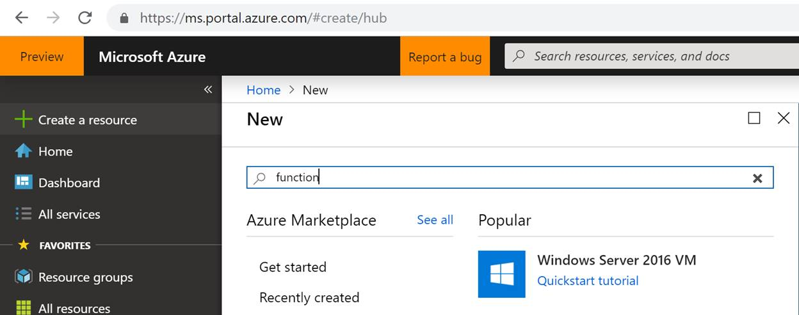

_Figure 24 – Searching for the Azure Function App_

Choose Function App from the search results list.

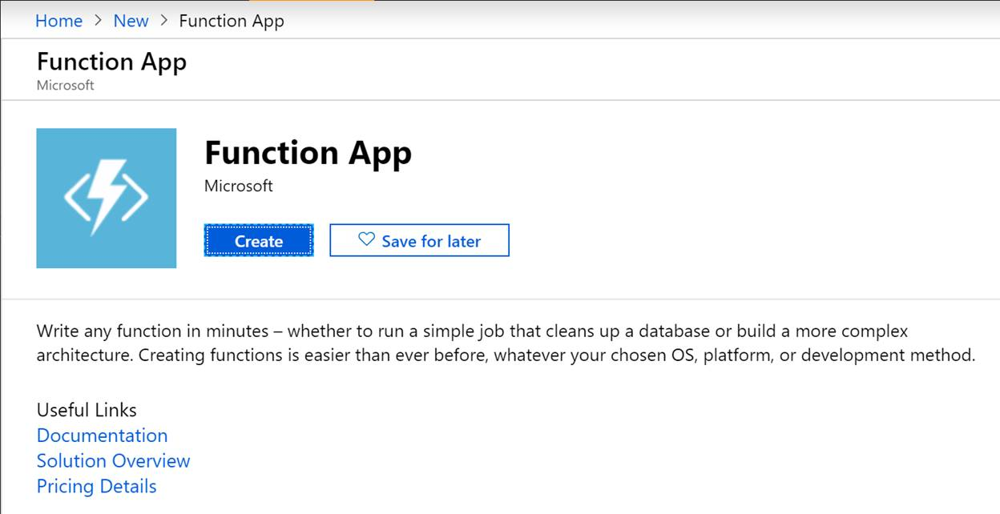

_Figure 25 – Creating a Function App_

Select the Create link. Enter your own selected unique name for the Function App in the App name field, change the Runtime stack to JavaScript, edit any other properties you need, and click the create button.

_Figure 26 – Entering properties for the new Azure Function App_

Deployment will take a minute or two. Once it is complete you will get a notification or you can choose App Services from the left navigation menu to see it.

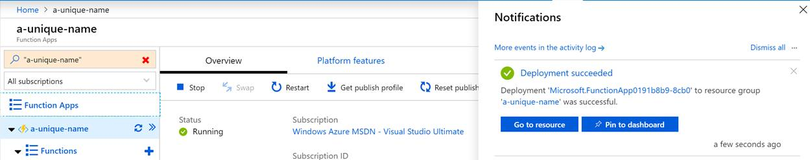

_Figure 27 – The deployed Azure Function App_

Select functions on the Function App and select + New function.

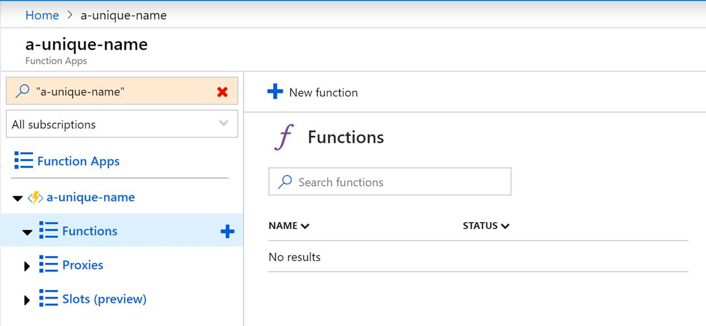

_Figure 28 – The New function button_

Select the HTTP Trigger.

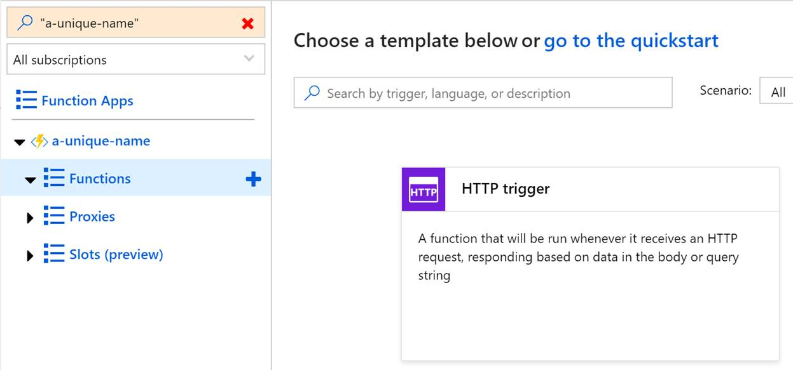

_Figure 29 – Select the HTTP trigger_

Enter the name as format and use the default Authorization level of Function. This means that you will be required to pass a code parameter with the function key each time you call the function.

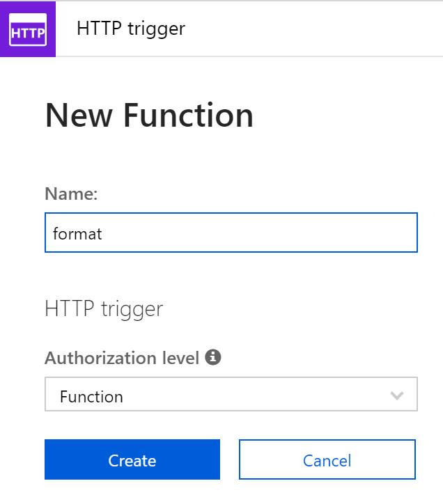

_Figure 30 – Configure the HTTP trigger_

Now you will see a template JavaScript function. Next, we&#39;re going to use Visual Studio Code to edit and deploy the function.

I&#39;m using it on Windows. Get Visual Studio Code for Windows here: [https://code.visualstudio.com/download](https://code.visualstudio.com/download)

Get the Azure Function App extension here: [https://marketplace.visualstudio.com/items?itemName=ms-azuretools.vscode-azurefunctions](https://marketplace.visualstudio.com/items?itemName=ms-azuretools.vscode-azurefunctions)

As described on the extension page, you will need to install npm and the Azure Functions module. Npm is installed with Node.js from https://nodejs.org/en/download/.

npm i -g azure-functions-core-tools@2

You also need to install git. It can be obtained here:

[https://git-scm.com/download/win](https://git-scm.com/download/win)

Choose a home directory on your local machine and clone the git repository for the Azure Function code.

At the git command prompt type:

git clone [https://github.com/pandrew1/Office365-IPURL-Samples](https://github.com/pandrew1/Office365-IPURL-Samples)

Using your npm prompt change to the AzureFunction directory where the file package.json is located and fetch the dependencies with:

npm install

Start Visual Studio Code and open the folder with the Azure Function as a workspace.

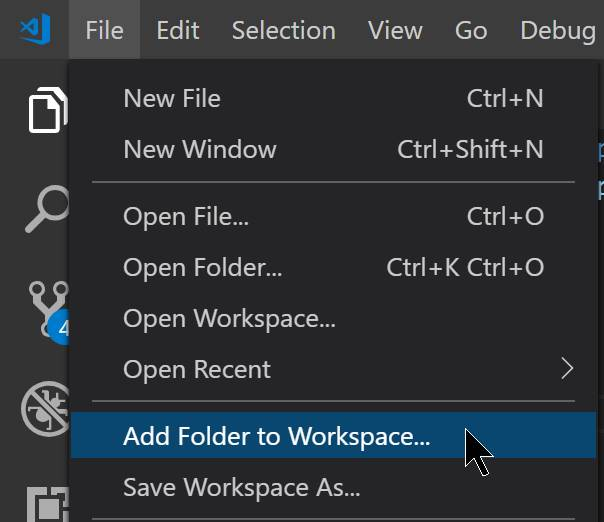

_Figure 31 – Configure the HTTP trigger_

Choose the folder called AzureFunction where the file package.json is located.

You can test locally in Visual Studio Code by pressing F5. Check the Terminal window for the test URL on your local machine.

To deploy to Azure, select the Azure integration icon at the bottom of the let navigation menu.

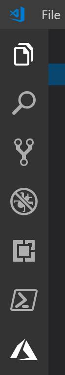

_Figure 32 – Left navigation menu in Visual Studio Code_

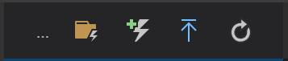

_Figure 33 – Top navigation menu for Azure in Visual Studio Code_

Select Deploy to Function App… which is the arrow pointing up to a line.

Select your previously created Azure Function App for the deployment.

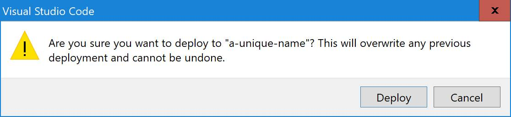

_Figure 34 – Overwrite dialog_

Go back to the Azure Portal and view the function that you just published. It should already be running. You can test it in the portal, and you can get the URL to it.

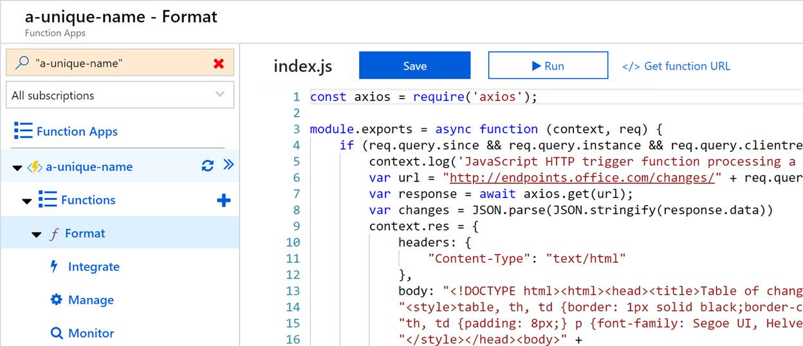

_Figure 35 – Deployed Azure Function_

You can use the test panel on the right after entering the required parameters. Scroll to the bottom of the panel to find the Run button that runs the test.

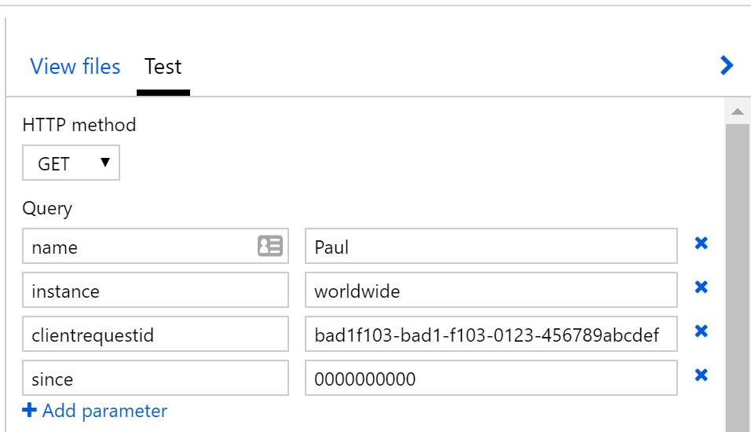

_Figure 36 – Test parameters_

After running the test you should see Status: 200 OK and the resulting HTML.

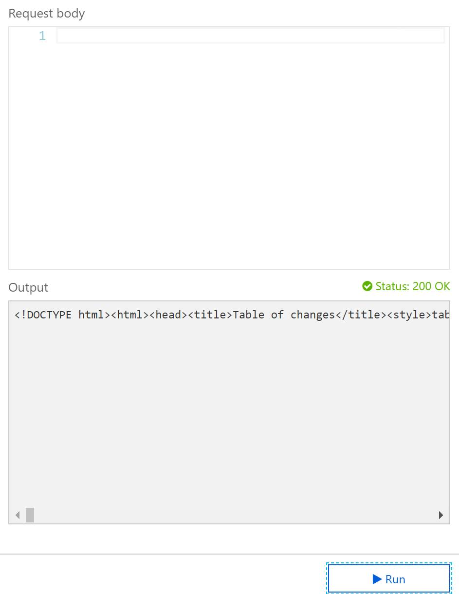

_Figure 37 – A successful test_

Now get the URL for your Azure Function. This will include your function key. Select Get Function URL.

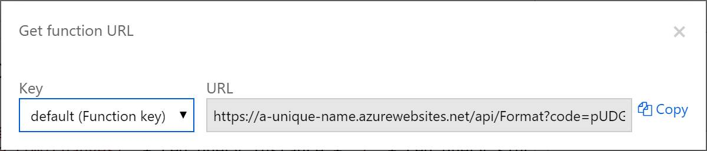

_Figure 38 – A successful test_

Here&#39;s what it looks like:

https://a-unique-name.azurewebsites.net/api/Format?code=pUDGdBY4yxeLOdAJB8LX3nuuuQ2T/xG0/xnzWhoBy0XgU4pjzqbURA==

## Step 7 – Updating the flow to use the formatting function

Now the you have an Azure Function working let&#39;s go back and update the Flow to call it. Here is the current HTTP 2 activity.

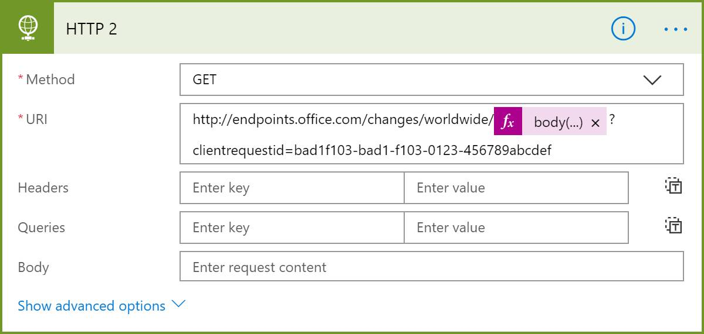

_Figure 39 – The HTTP 2 activity to be updated_

We&#39;re going to replace the URI with the URI to your new Azure Function. We will keep the Flow expression that identifies the previous version number but update the first static part of the URI. The first part should point to your Azure Function URL. Here is my test one, but you need to use your own URL and your own code. The second static part of the URI can be removed.

https://a-unique-name.azurewebsites.net/api/format?code=pUDGdBY4yxeLOdAJB8LX3nuuuQ2T/xG0/xnzWhoBy0XgU4pjzqbURA==&amp;name=paul&amp;instance=worldwide&amp;clientrequestid=bad1f103-bad1-f103-0123-456789abcdef&amp;since=

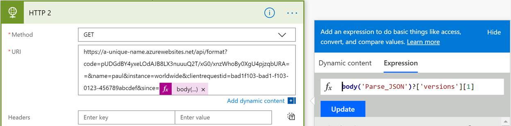

_Figure 40 – The updated HTTP 2 activity_

#
# Summary

A simple Microsoft Flow can make the IP/URL change publishing easy to distribute and review.

You could extend this Flow with approvals as needed and forward the changes to your team who manages network perimeter updates.
